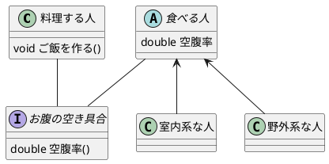

# クラス構造を考える(集約など)

## 本章の目的
クラス設計の中で悩む部分は多くありますが，今回はどのような物をコンポーネントにするのがよいかを考えてみます。だいたい集約な話と思います。


本章の対象は次のような方です
* 一つの関数/クラス等に全ての処理を書くのはよろしくないのだが、意識して実現したことはあまりない(感覚派)/自分のコードに適用するのが難しい人
* 巷では継承はよくない、集約が良い。is-aなのかhas-aなのかを考えてみようと言われています。なぜこれらを考え分けるのかをもうちょっと知りたい人
  * なぜかという理解が拡張する際に面倒だから、以外の理由が知りたい

集約の中にも種別がありますが，ここでは「自クラスが他のクラスを所持し、それを用いて自クラスの機能を実現する」ことを集約と呼びます


## 舞台の説明
さてコンポーネントにすべきものを考えるのですが、クラス構造を考えて情報の分割方法を検討します。この際にはクラスの拡張性や再利用性に着目して考えていきます。今回は次の舞台とします

* 「料理する人」がいる
* 「料理する人」は「調理器具」を使い料理をする
* 「調理器具」は「フライパン」と「鍋」の2種類がある

これを設計した場合に次の3パターンを思いつきました。これ以降では1つ目の集約パターンをパターン1, 2つ目の継承パターンをパターン2, 3つ目の継承パターンをパターン3と呼びます

今回の結論としてはパターン1が良いだろう、ですので次からパターン1と2, 1と3を比較していきます

:::details plantuml
```plantuml
class 料理する人 {
    調理器具 器具
}

abstract class 調理器具 {
      
}

料理する人 --o 調理器具
調理器具 <-- フライパン
調理器具 <-- 鍋
```
:::


:::details plantuml
```plantuml
abstract class 料理する人 {
}

class フライパンで料理する人 {
      
}

class 鍋で料理する人 {
      
}

料理する人 <-- フライパンで料理する人
料理する人 <-- 鍋で料理する人
```
:::


:::details plantuml
```plantuml
class 料理する人 {
}

abstract class 調理器具 {
      
}

料理する人 <-- 調理器具
調理器具 <-- フライパン
調理器具 <-- 鍋
```
:::


## パターン1と2の比較

この比較では見る視点を自クラスと他クラスに分けて考えます。他クラスとのやり取りも含んだ共通化と、自クラス/他クラスで使うだけの共通化で示すべき内容に差があるためです

### 外部クラスから見た場合

まず「料理する人」を外から見た場合の差がどうなるかを考えてみます

次のような状況を考えた場合、「料理をする人」の調理器具の差は関係がなく、ただただ「料理する人」が勝手に「ご飯を作る」ことをしていることが分かります。そのため外から見る分にはどちらの設計であっても同じ意味であると考えられます

つまり関係ないクラスから見たらどう共通化しても意味的/利便性的な差はないことが分かります(集約ではなくカプセル化の話になってしまった)

よってこの観点からはどちらの設計でもよい、と結論付けられます

:::details plantuml

:::


### 自クラスから見た場合

外から見る分にはどちらのパターンであっても問題ないことが分かりました

そのため次は範囲を狭めて自クラスから見た場合を考えてみます

現在の状況では困った点が調理器具を増やす場合にめんどくさいという部分に気が向いてしまい他の問題が分かり辛いため、少し状況を拡張することを考えてみます。今回は調理器具に対して耐久力の概念を追加してみます。この場合次のような構造になります

* パターン1

:::details plantuml
```plantuml
class 料理する人 {
    調理器具 器具
}

abstract class 調理器具 {
    int 耐久力
}

料理する人 --o 調理器具
調理器具 <-- フライパン
調理器具 <-- 鍋
```
:::


* パターン2

こちらは次の2パターンが考えられます

:::details plantuml
```plantuml
abstract class 料理する人 {
      int 器具の耐久力
}

class フライパンで料理する人 {
}

class 鍋で料理する人 {
}

料理する人 <-- フライパンで料理する人
料理する人 <-- 鍋で料理する人
```
:::


:::details plantuml
```plantuml
abstract class 料理する人 {
}

class フライパンで料理する人 {
      int 器具の耐久力
}

class 鍋で料理する人 {
      int 器具の耐久力
}

料理する人 <-- フライパンで料理する人
料理する人 <-- 鍋で料理する人
```
:::


さてどうでしょうか。まず各パターンの情報の持ち方の差を見てみましょう

パターン1を文章で表すとこんな感じになると思います
```
「料理する人」が「調理器具」を持ちそれには「耐久力」がある
```

「調理器具」に「耐久力」を持たせています。今回拡張したかった内容をそのまま反映することができています。またこの状態は形態素になっていることがわかります


パターン2を文章で表すとこんな感じになると思います
```
「耐久力を持つ調理器具」を使う「料理する人」がいる
```
「調理器具」を「調理器具を持つ人」として表現しています。この「調理器具を持つ人」はまだ意味的に分割可能な状態であるため、「調理器具」の性質の追加のためには少し遠回しな表現です


この2つを比較すると意味的な分割度合いとしてパターン1のほうが整理しきれていると考えられます。情報が整理されているとなにが良いかなのですが、拡張性や再利用性が上がります

拡張性は今回の事例から分かるように、要素を増減する際の修正箇所の量に影響してきます。パターン1では「調理器具」を抜き出してクラス化していることから、修正範囲が1か所となりました。一方でパターン2では全クラスに対して変更を入れる必要が出てしまいました。面倒ですね

次に再利用性ですが、「調理器具」という概念自体は「料理する人」以外にも適用することができます。例えばお店で売られているものとして再利用したい場合はパターン1はそのまま使うことができますが，パターン2は使うことができません

意味としての分割を適切にすることが大事なことが分かります

よってこれらの観点によりパターン1のほうが楽であることが分かりました


## パターン1と3の比較


次にパターン1と3を比較します。こちらはパターン2と異なり耐久力を追加したとしても差分がありません

ですがパターン3の意味を考えてみましょう。文章で表すとこんな感じになると思います
```
「フライパン」は「調理器具」であり、また「調理器具」は「料理する人」である
```

当然おかしいため、このおかしさがどのような不利益を生じさせるかを考えていきます。今回は次の2点の存在によりパターン3がダメであると考えられました

1. 意味的な破綻により始めて見る人へのハードルが上がる
2. 状況を複雑にする場合に不都合がある

### 意味的な破綻により始めて見る人へのハードルが上がる
パターン3は先ほど述べたように意味が破綻しています。具体的に破綻するコードを見てみましょう

``` csharp
public class Cook
{
    public void Cooking()
    {
    }
}
public abstract class Kitchenware : Cook
{
}
public class Pan : Kitchenware
{
}

void main()
{
    Pan pan = new Pan();
    pan.Cooking();
}
```

どうでしょうか、フライパンが自主的に料理をすることになっています。すごい世界ですね。このコードを見ると魔法の国かなと思いきや継承元をたどるとコックさんがいるので理解に苦しみます

そのため他の実装者の理解を拒み拡張時に手間がかかる/適切な実装ができなくなるでしょう

とはいえ規模が小さいなら問題ないとか、全てを一瞬で理解できる場合には問題がないように思えてしまいます

作りたいものの規模が小さかったり、他の実装者が全てを理解する特殊技能を持ち合わせていたとしても(結論の先取りとなりますが)次項での実装時の不都合があるため、やはりよくないでしょう

※本当に規模が小さくまた未来永劫拡張しないコードなら問題はありませんが、そのようなコードを書くならそもそもこんなクラス構造を考慮せずにべた書きしたほうが良いでしょう。今回は多分拡張しないと思っているけど一応クラスを用いて開発する、という場合であっても不利益があるという部分を想定しています

### 状況を複雑にする場合に不都合がある
先ほど追加した耐久力がある場合、調理器具の耐久力が0になった際に調理器具を持ち替えたい場合を考えます

#### 舞台の確認
拡張した舞台としては次のようになります

* 「料理する人」がいる
* 「料理する人」は「調理器具」を使い料理をする
* 「調理器具」は「フライパン」と「鍋」の2種類がある
* 「調理器具」は使用すると耐久力が減り、0になると使えないため「調理器具」を変更する ←new

これをパターン1と3に当てはめると次のようになります

:::details plantuml
```plantuml
class 料理する人 {
    調理器具 器具
    void 料理する()
}

abstract class 調理器具 {
    int 耐久力
    bool 使う
}

料理する人 --o 調理器具
調理器具 <-- フライパン
調理器具 <-- 鍋
```
:::


:::details plantuml
```plantuml
class 料理する人 {
    void 料理する()
}

abstract class 調理器具 {
    int 耐久力
    bool 使う
}

料理する人 <-- 調理器具
調理器具 <-- フライパン
調理器具 <-- 鍋
```
:::


#### 実装時を考える
さてこの2つの設計を制御する場合を考えてみましょう。新たに追加した「「調理器具」は使用すると耐久力が減り、0になると使えないため「調理器具」を変更する」をどのように実現すればよいでしょうか

パターン1では次のようになります
```csharp
public abstract class Kitchenware : Cook
{
    protected int count;
    abstract public void Use();
    abstract public bool CanUse();
}

public class Pan : Kitchenware
{
    public override void Use()
    {
        this.count -= 1;
    }

    public override bool CanUse()
    {
        if(this.count <= 0)
        {
            return false;
        }
        else
        {
            return true;
        }
    }
}

public class Cook
{
    Kitchenware kitchenware = new Pan();
    public void Cooking()
    {
        kitchenware.Use();
        if (kitchenware.CanUse() == false)
        {
            /* 調理器具を持ち替える */
        }
    }

}
}
```

料理した際に壊れたかどうかを判定し、壊れていたら新たなインスタンスを作るなり修理をするなりすれば実現できることが分かります

パターン3では次のようになります
```csharp
public class Cook
{
    public void Cooking(){ }
}
public abstract class Kitchenware : Cook
{
    protected int count;
    abstract public void Use();
    abstract public bool CanUse();
}
public class Pan : Kitchenware
{
    public override void Use()
    {
        this.count -= 1;
    }
    public override bool CanUse()
    {
        if (this.count <= 0)
        {
            return false;
        }
        else
        {
            return true;
        }
    }
}
void main()
{
    Pan pan = new Pan();
    pan.Cooking();
    pan.Use();
    if(pan.CanUse() == false)
    {
        /* 調理器具を持ち替える */
    }
}
```
※制御する部分をmain関数と考えてください

こちらは料理する関数では調理器具を劣化させることができません。そのため呼び出す側がそこを制御しなくてはいけないのですが、まだ関数化すべきでしょう。そのためmain関数から分割して謎関数を作ることになりますが，それではクラス分けを活かしきれていないことになります

つまり意味が破綻していると実装時に親子関係を逆転させたくなってしまいます。ですが逆転させてしまうとクラス化の目的を果たすことが出来ていません

また仮に多少の労苦はいとわないということで調理器具やフライパンに料理する関数を作成すればパターン1と同様の使用感を得ることはできます。しかし，それこそ魔法の国となってしまい本来の設計意図を実装に反映させる事ができません

よってパターン1のほうが適切である、ということが分かりました

### まとめ


(クラス図じゃないか)

* 他クラスから見て差分が生じない場合であっても、意味的に共通化できるものは分割すべき
* 継承, 集約のどちらでも実現可能であったとしても集約で表現できるものは集約で表現した方が意味的に小さいので意図が伝わりやすい/修正範囲が少なくて済む
* 意味的に破綻すると、実装時点では大丈夫であっても拡張時など別の時期に破綻し苦しむことになる


つまり…
* 実装をしていておかしいと思ったら、それは設計がおかしい。自信を持とう
意味的に破綻していないか確認しよう、ヨシ！
