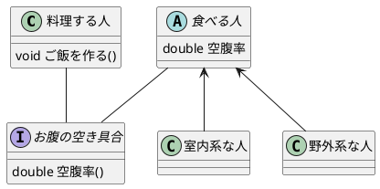

# クラス構造を考える(継承など)

## 本章の目的
クラス設計の中で悩む部分は多くありますが，今回は共通化部分についてどのようにクラスとして表すべきかを考えてみます。対象は継承やとインターフェースあたりです

本章では次の内容を考えてみました
* 対象とする共通化
* 各仕組みの活用方法
  * 抽象クラス
  * インターフェース

まずここで題材にする内容を明確にしていきます。その後をどのように活用するのかを見ていきます。今回は(通常クラスの)継承, (抽象クラスの)継承, インターフェースを各事例に当てはめてみてどれを用いるのが良いのかを確認していきます


## 対象とする共通化

本章で考えたい「共通化」をご飯を作る人と食べる人をもとに説明してみます

次の状況を表すことを考えてみます

* 「食べる人」と「料理する人」の2種類の人がいる
* 「料理する人」は定期的に「食べる人」は空腹具合を聞く
* 「食べる人」のお腹空き力には個人によりばらつきがある


:::details plantuml

:::

上記状況を設計してみると、最終的にこのような構造になりました。これらは抽象クラスやインターフェースは使用せずとも記法としては実現できるのですが、なぜこの構造を良いと思ったのか、ということをこれから見ていきます

赤枠の部分で通常クラスと抽象クラスの使い分けを考え, 緑枠の部分で継承とインターフェースの使い分けを考えます

## 通常クラスと抽象クラスの使い分け


赤枠部分について考えてみます

食べる人は時間経過によりお腹がすきます。その中でも行動によって空腹率の変動率が高い人と低い人もいるということを考えてみます。このことを示す際に，通常クラスによる継承を考えてみます

コードは次のようになります
```csharp
namespace Hungry
{
    class EatHuman
    {
        protected double hungry;
        double decrease_rate = 1.0;
        public double GetHungry()
        {
            return hungry;
        }
    }

    class OutdoorHuman : EatHuman
    {
        double decrease_rate = 1.5;
    }
    class IndoorHuman : EatHuman
    {
        double decrease_rate = 0.5;
    }

}
```

このEatHumanとOutdoorHuman/IndoorHumanの関係を他の方法で示すとどうなるのか見てみましょう

### 抽象クラスとの比較
抽象クラス自体はインスタンスを生成することができません。そのため通常クラスでのEatHumanの示していたお腹の減り率1.0だった人を示すために「普通の人」を追加することにします

※当然通常クラスでの設計でも「食べる人」にabstractを付けないだけで同様の構成とできます。しかし、その構造はabstractを実装していない言語でabstractの実現したいことを行っていると取れるため、今回はこのような比較となっています


コードは次のようになります

```csharp
namespace Hungry_Abstract
{
    abstract class EatHuman
    {
        double hungry;
        double decrease_rate;
        public double GetHungry()
        {
            return hungry;
        }
    }
    class NormalHuman : EatHuman
    {
        double decrease_rate = 1.0;
    }
    class OutdoorHuman : EatHuman
    {
        double decrease_rate = 1.5;
    }
    class IndoorHuman : EatHuman
    {
        double decrease_rate = 0.5;
    }
}
```

この2つの示し方の差は(記法的な差分を無視すると)お腹減り率1.0を示す部分が次のように分かれている点だけです
* 通常クラス：基底クラスにて表現
* 抽象クラス：継承クラスの1つで表現

これが意味的にどのような差を生むのでしょうか。沢山の人(例えば空腹力が普通の人と高い人)に対して空腹率を調べる状況を考えてみます

```csharp
double CheckHungry(EatHuman human){
    double hungry = human.GetHungry();
    // 以降に何か処理がある
}

List<EatHuman> humans = new List<EatHuman>()
{
    new EatHuman(),     //通常クラスの場合
    new NormalHuman(),  //抽象クラスの場合
    new OutdoorHuman()
};

void loop(){
    foreach(var human in humans)
    {
        CheckHungry(human);
    }
    // 以降に何か処理がある
}
```
この際にはhumansに通常クラスで構成した場合は「EatHuman, OutdoorHuman」を、抽象クラスで構成した場合は「NormalHuman, OutdoorHuman」を入れることになります。そして空腹率を調べる関数CheckHungryの引数の型は「EatHuman」とします

さてCheckHungryから見た際の引数はどのような意味を持つのでしょうか。この関数にとっては空腹を調べる際にその人が野外系なのか室内系なのか等の分類は関係なく、食べる人のお腹の空き具合が重要です

通常クラスで構成した例で考えると、「食べる人」を示したいのか「普通な食べる人」を示したいのか型から判別することができません

一方、抽象クラスで構成した例で考えると「食べる人」を示したいということがわかります


そのため、利用する側から見て「共通化」できる場合には抽象クラスとしておいた方が設計意図をより反映できると考えられます

よって


と


では、後者の方が適切ではなかろうか、と考えられました


## インターフェースとの使い分け


次に緑枠の部分を見ていきます

先の検討では「誰」がお腹の空き具合を調べるのかをぼかしており、(アクターとして現れない何らかの)世界の仕組みが調べているということで進めていました。ここでは「料理する人」が「食べる人」のお腹を調べるという新事実が発覚したことにします。

インターフェースを用いると次のようなコードとなります

```csharp 
namespace Hungry_Interface
{
    interface IHungry
    {
        public double GetHungry();
    }
    abstract class EatHuman : IHungry
    {
        double hungry;
        double decrease_rate;
        public double GetHungry()
        {
            return hungry;
        }
    }

    class NormalHuman
    {
        double hungry;
        double decrease_rate = 1.0;
    }
    class OutdoorHuman
    {
        double hungry;
        double decrease_rate = 1.5;
    }
    class IndoorHuman
    {
        double hungry;
        double decrease_rate = 0.5;
    }
}
```

### 継承との比較


継承方式の際には、全てを「食べる人」が所持しているとします
※1: 継承元が抽象であってもなくても変わらないため抽象クラスで考えます
※2: IHungryにinterfaceを付けずclassを付与しても当然成り立ちますが，前項同様に内容的差がなくなるためこのような構造とします


```csharp 
namespace Hungry_Inheritance
{
    abstract class EatHuman
    {
        double hungry;
        double decrease_rate;
        public double GetHungry()
        {
            return hungry;
        }
    }

    class NormalHuman
    {
        double hungry;
        double decrease_rate = 1.0;
    }
    class OutdoorHuman
    {
        double hungry;
        double decrease_rate = 1.5;
    }
    class IndoorHuman
    {
        double hungry;
        double decrease_rate = 0.5;
    }
}
```

この2つの示し方の差は(記法的な差分を無視すると)GetHungry関数がクラスとして独立しているかどうかという点だけです
* インターフェース：別のクラスにて表現
* 抽象クラス：自クラスにて表現

問い合わせ部分を別クラスとして分離させることに何の意味があるかを考えるために、状況を拡張します

食べる人に渇きを追加し、給仕さんを追加し水を注いでくれるようにします。給仕さんはお腹の空き具合は考慮せず、喉が渇いている場合に水を注いでくれる方ということにします(いい例が思いつかなかった)

この場合各パターンは次のような関係となります
※コードは長くなるため割愛します


さて後者の図でのだめ部分を出すことで前者の正当化をします。クラスを静的に見ると食べる人へのアクセスをする際に空腹率と渇き率の両方を取得可能になります

そのため料理する人が渇き率を取得したり、給仕さんが空腹率を取得することができます。しかし彼らはご飯を作ったり水を注いだり専門のことしかしないため、取得で来たところで使い道はなく逆に得られることで水を注ぐ際にお腹の空き具合と渇き具合の両方を考慮するのではないか、という既存のクラスに対して追加修正をする際にあらぬ疑いの可能性を生むことになります

よってアクセスすることのできる範囲を作りとして明示することができると上記のような疑いを生まずにすみます。そのための仕組みとしてクラスを分割して外部へ公開するためのインターフェースという概念が存在しているのでしょう。これを用いる設計とすることが、設計意図を反映することになると考えられます

## まとめ

* 抽象クラスは「使う側」から見て共通化できる範囲をまとめるために使える
* インターフェースは「使う側」に見せたい範囲を分割するために使える
