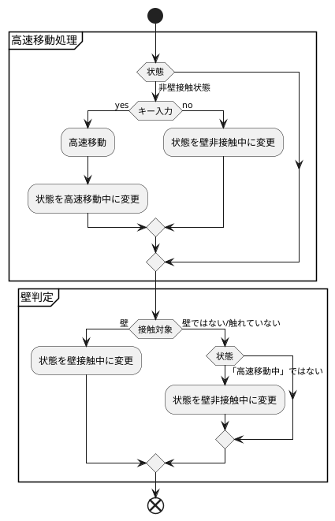
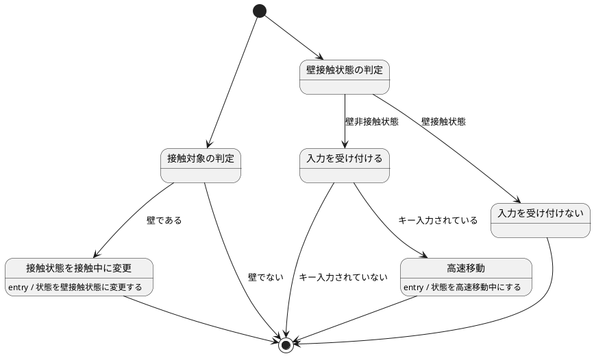
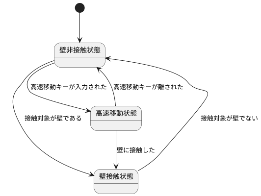
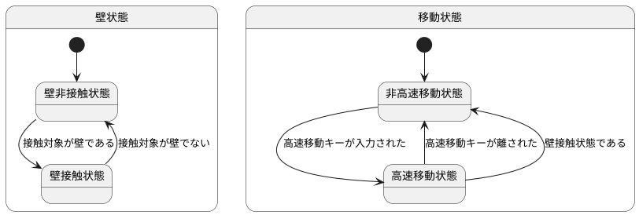
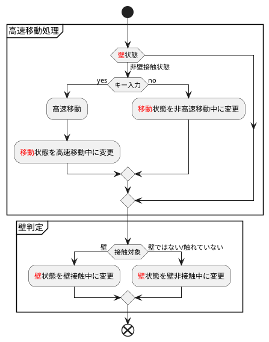

# アンチパターンから検証する状態遷移の示し方

## 本稿の内容
本稿では状態遷移図とアクティビティ図の使い分けに着目し、状態遷移で示すべき内容を明確にしていきます。

本稿の対象は次のような方です
* 状態遷移図とアクティビティ図の違いが分からない。状態遷移図ですべて表せてしまうのではないかと思うため使い分けを知りたい
* 状態遷移図で着目すべきは状態だがなぜ状態に着目すべきかがすっきりしないので、すっきりしたい

次の内容をまとめます
* 状態遷移図の示すべき内容とは
  * 「状態遷移図」とは
  * なにをどこまで状態遷移図で示すべきなのか
* 残念な状態遷移図の改善
  * どこが残念でどうすれば良いのか

まず状態遷移図のあるべき姿を確認し、その後残念状態を解消することで状態遷移をどのように示せばよいのかを考えていきます

なお本記事は動画化もしています。読み上げて欲しい系な方はどうぞ

:::details 動画
@[youtube](wGR9a0r_dMU)

:::

## こんなシステムを作りたかった
今回次のようなシステムで考えてみます

* オブジェクトは動く
  * 動作速度は2種類(普通, 高速)
  * 高速動作には時間制限を付ける(今回時間を制限する部分は割愛しています)
* オブジェクトは次の3状態を持つ
  * 非高速移動中：高速移動していない
  * 高速移動中：高速移動している
  * 壁接触中：壁に当たっている
* 壁判定, 移動の仕組みは既存のものを流用したい気持ちがある
  * (だから壁状態と移動状態が合体しつつあるという想定)
* オブジェクトが壁に当たった際は高速移動状態を解除する

上記システムのうち移動処理, 壁判定まで作り上げ，壁に当たった際に解除するために今回の3状態を考え出した。そこの設計レビュー中という想定です

※もっと簡素な実現方法があるとか、そもそもその状態を持たせるのはおかしくない?とかそういう観点もあるのですが、説明のために作り出した問題です。ゆえに設問に若干無理があるという部分はご承知おきください

## こんな状態遷移図ができた

:::details plantuml
```plantuml
[*] --> 壁判定用ループ
壁判定用ループ --> 壁判定 : 何かに触れた

state 壁判定{
[*] --> 接触対象の判定
接触対象の判定 --> 接触状態を接触中に変更 : 壁である
接触状態を接触中に変更 : entry / 状態を壁接触状態に変更する
接触対象の判定 --> 壁判定用ループ : 壁でない
接触状態を接触中に変更 --> 壁判定用ループ
}

[*] --> 移動用ループ
移動用ループ --> 高速移動処理

state 高速移動処理 {
[*] --> 壁接触状態の判定
壁接触状態の判定 --> 入力を受け付ける : 壁非接触状態
壁接触状態の判定 --> 入力を受け付けない : 壁接触状態

入力を受け付ける --> 高速移動 : キー入力されている
高速移動 : entry / 状態を高速移動中にする
高速移動 --> 移動用ループ
入力を受け付ける --> 移動用ループ : キー入力されていない
入力を受け付けない --> 移動用ループ
}
```
:::

なんとなく伝えたいことはわかります。。。が、複雑なシステムになるとわからなくなります。

困ってしまいました

## 状態遷移図の示すべき内容

### 「状態遷移図」とは
状態遷移図とは次のようなものと考えています
* システムの振る舞いを状態によって区切って示す
* 「状態」の「遷移」を表す「図」
* 「遷移」は「イベント」により駆動する

具体的にどのようなものを示すことができるのかを見てみましょう。当初示したシステムは複雑なため、簡単な例として、お腹がすいた状態をもとに考えてみます

お腹具合状態には次の3状態が存在することにします
* お腹がすいていない
* すこしお腹がすいた
* とてもお腹がすいた

「とてもお腹がすいたからご飯を食べる」という場合は次のように示します
* イベント：「とてもお腹がすいた」が発生
* 遷移：「お腹がすいていない状態」→「とてもお腹がすいている状態」へ変化
* 振る舞い：「とてもお腹がすいている状態」に変化したため「ご飯を食べる」

※状態遷移図の要素としてentry, do, exitなどがありますが，(見たままですし)今回は割愛します

これを状態遷移図で示すと次のようになります

:::details plantuml
```plantuml
[*] --> お腹がすいていない
お腹がすいていない --> とてもお腹がすいている : とてもお腹がすいた
とてもお腹がすいている --> お腹がすいていない : ご飯を食べる
お腹がすいていない --> すこしお腹がすいている : すこしお腹がすいた
すこしお腹がすいている --> お腹がすいていない : おやつを食べる
```
:::


ここで疑問が出てくるのですが(出てくることにします)、フローチャートとの違いがわからなくなりました。さて本当に状態遷移図を描くことが正しいのでしょうか

何が違い状態遷移図を使用するのか、ですが私は示したいもの/示し方の差と捉えました

今回の内容だと次のようなフローチャートを書くことができます
:::details plantuml
```plantuml
start

:お腹具合を調査する;
if (お腹具合状態) then (とてもすいている)
    :ご飯を食べる;
    :状態をお腹がすいていないに変更;
else if(お腹具合状態) then (すこしすいている)
    :おやつを食べる;
    :状態をお腹がすいていないに変更;
else (お腹がすいていない)
    :なにもしない;
endif

end
```
:::


このフローチャートの「開始」と「終了」がどこに繋がっているのかを考えてみます

お腹具合状態から逸脱してもう少し粒度の粗い図で見ると例えば次の「空腹状態の確認」部分に当てはめることができます

:::details plantuml
```plantuml
start

:起床;
#Mistyrose:空腹状態の確認;
:出発準備;

end
```
:::

始めのフローチャートは空腹状態の確認の振る舞いを示していたことが分かりました

よって「お腹がすいた状態」の振る舞いをフローチャートにより示すことはでき、特に問題もないように思えます

ただフローチャートで示すと次のようなことがあるため少し微妙に感じられます
* 状態の変化がまとまっていないためどこをみれば状態が変化するのかを追うのが大変
  * 「とてもすいている」状態から「すこしすいている」状態へ変化するのかどうかなど
* 状態の変化自体もアクティビティとして定義する必要があり冗長
  * 「状態をお腹がすいていないに変更」
* 状態の変化も示すことはできるが，そことは違う箇所をフローチャートでは見たい(のでより粒度の粗い図が欲しくなる、はず)

ではなぜ「状態の変化」に着目して表現したくなるのでしょうか。
状態遷移図は「状態の変化」、フローチャートは「振る舞いの流れ」を示していると考えた場合
「状態の変化」は「振る舞いの流れ」の必要条件になっていることが多いと思います。
そのため状態のほうがシステムを表すのにより大きな意味を持つため
この「状態の変化」でシステムを考えると、変化に強くなるため
と思いました。

よって状態遷移図に付随してフローチャートがあること自体は問題がないのでしょうが、状態に着目して区切ることができる部分は状態遷移図で示せるように設計をすることが求められていると考えました。

以上より状態の遷移は状態遷移図で示すことが適切であることがわかりましたので、次から状態遷移図で示したいことを「示すべき対象(なに)」と「示すべき範囲(どこまで)」から考えていきます

### なにをどこまで状態遷移図で示すべきなのか
その名の通り
* なに：「状態」の「遷移」
* どこまで：「状態」を「遷移」させるのに必要なところまで
を示します、がこれでは困るためもう少し掘り下げて考えてみます

今回は先ほどのお腹具合状態のフローチャートに対して、振る舞いを追加してみます。

:::details plantuml
```plantuml
start

if (お腹具合状態) then (とてもすいている)
    #Mistyrose:スーパーへ行き食材を購入する;
    #Mistyrose:調理する;
    :ご飯を食べる;
    :状態をお腹がすいていないに変更;
else if(お腹具合状態) then (すこしすいている)
    #Mistyrose:コンビニへ行きおやつを購入する;
    :おやつを食べる;
    :状態をお腹がすいていないに変更;
else (お腹がすいていない)
    :なにもしない;
endif

end
```
:::


フローチャートとしては適切な表記のままです。ご飯を食べるためには食材/調理が必要なためフローに起こすことは意味がある場合が存在します(示したいことによる)

ですが状態遷移としてはどうでしょうか。今回追加した情報は無くとも成立しますし、むしろどの挙動により状態遷移をしているのかが分かりづらくなってしまいました

「とてもすいている」際に状態を「お腹がすいていない」に変更できる理由が、「食材を購入する」、「調理する」、「ご飯を食べる」のどれによるものなのかがわかりません
。(無理はありますが)食材の購入後に事故にあった場合の処理を追加する時は、お腹具合状態の処理をどうすればよいのでしょうか。実は購入しただけで腹が膨れ、調理以降は食材を無駄にしないために実施しているだけかもしれません(それはない)

つまり状態遷移図では、状態を遷移させる部分に着目しそれ以外の要素は記載しないことで状態の遷移を分かりやすくしています

ゆえに状態遷移を示すのに状態遷移図が用いられることが多いのでしょう

## 残念な状態遷移図の改善
さて前項までで次の要素が状態遷移図に必要なのだということとなりました
* 状態の遷移は状態遷移図で示すことが良い
* 状態遷移図は状態を遷移させる部分に着目することが良い

この前提をもとに残念状態を見ていきます

### どこが残念でどうすれば良いのか
一言でいうと「状態遷移」に関係のない部分全部、なのですがいろいろと詰め込みすぎていますが次の内容を見ていきます

* 状態遷移には関係のない処理
* フローを示している
* そもそも各ノードが状態ではない

まず気になることは、ノードやエッジにかかわらずそもそも状態と状態に関係のないものが混在している点です。分類しなおすことで今後の修正を考えていきます


今回の図は次のように分類することが出来ました

* 赤枠
  * 状態にかかわらず必要な「処理」(処理の流れを示すこととしては必要)
  * 状態遷移図としては不要、この部分を示す場合は別途アクティビティ図を書いたほうが分かりやすい
* 緑枠
  * ノードが特定の状態で実施する処理で分類されている
  * 状態の遷移を示したいため、状態で分類する必要がある

まず赤枠で示したい処理の流れはアクティビティ図に変換します
次に緑枠の整理として状態ではない「壁判定」・「高速移動処理」の処理での区切りを削除します

:::details plantuml

:::


(状態遷移図の説明のため、この程度の処理ならばアクティビティ図に絞るほうが良いのでは?と思う気持ちは抑えます)

:::details plantuml

:::


処理の分類が無くなったため一時的に見づらくなりますが続けます。続いてノードの分類を状態に変更します

現在の図にあるノード, エッジは次の状態で利用していると分類することができます
| ノード                 | エッジ                                  | 取りうる状態                             |
| ---------------------- | --------------------------------------- | ---------------------------------------- |
| 接触対象の判定         | 壁である/壁でない                       | 全状態(処理のため状態遷移図には表れない) |
| 接触状態を接触中に変更 | -                                       | 非接触状態, 高速移動中                   |
| 壁接触状態の判定       | 壁非接触状態/壁接触状態                 | 壁接触中, 非壁接触状態                   |
| 入力を受け付ける       | キー入力されている/キー入力されていない | 壁非接触状態, 高速移動中                 |
| 入力を受け付けない     | 壁接触状態                              | 壁接触状態                               |
| 高速移動               | -                                       | 壁非接触状態, 高速移動中                 |

これを踏まえて状態をもとに書き変えると次のようになりました

ノードが状態を示し，エッジが遷移条件と遷移先を示すようになりました。「状態遷移図」としてはこれが良き状態と思います。処理の流れを示したい場合は先に作成したアクティビティ図を出します

:::details plantuml

:::


## まとめ
* 状態遷移図のノードは「状態」にする
* 状態遷移図のエッジには「状態遷移」しか記載しない
* システムの流れも記載したい場合はアクティビティ図を添える

## 終わりに
どのように考えてみても壁接触と移動の状態は独立しているので意味的におかしい
という気持ちが抑えられないとこうなります。設問に無理があるんですよ…
壁状態と移動状態は独立しており、移動処理で壁状態を参照するだけで良い

:::details plantuml

:::


:::details plantuml

:::


